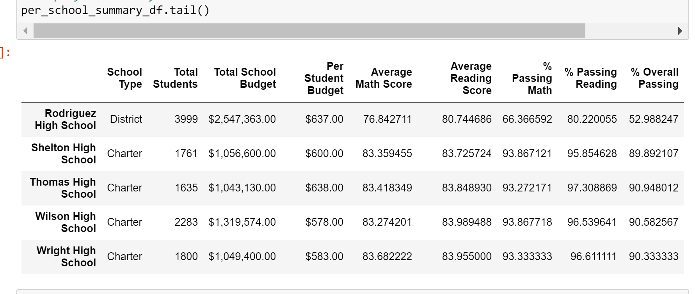
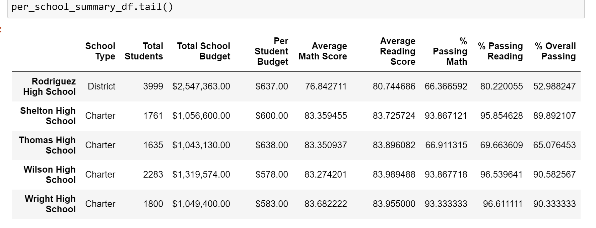
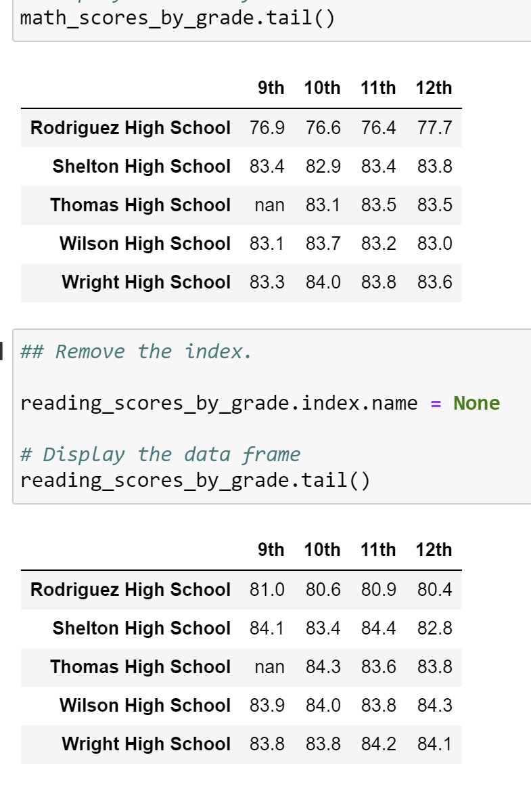
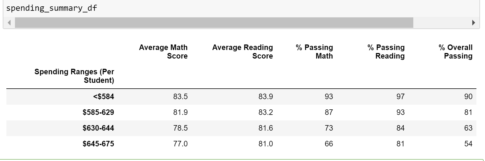
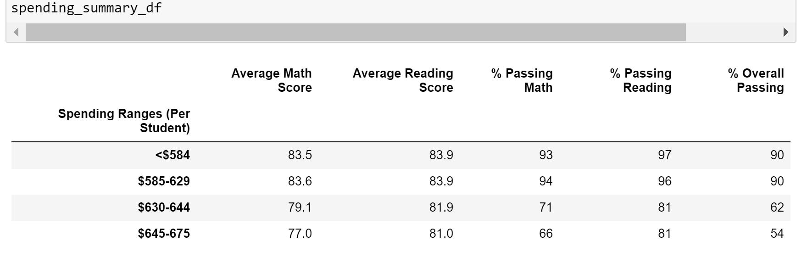
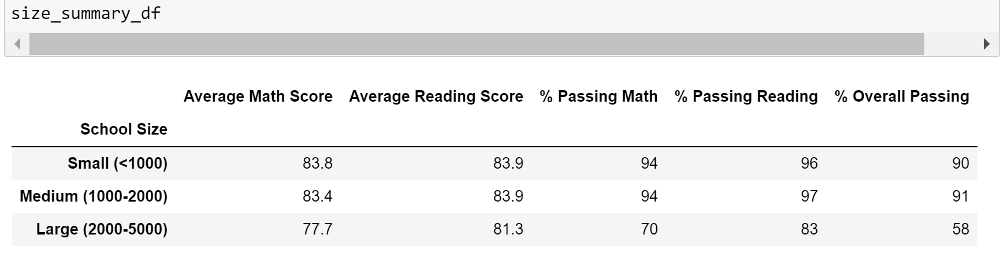
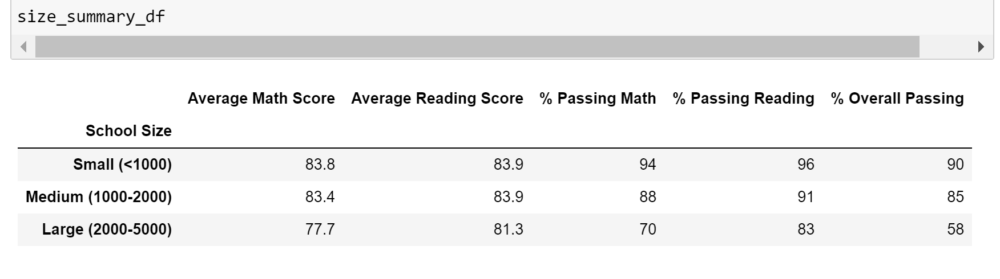
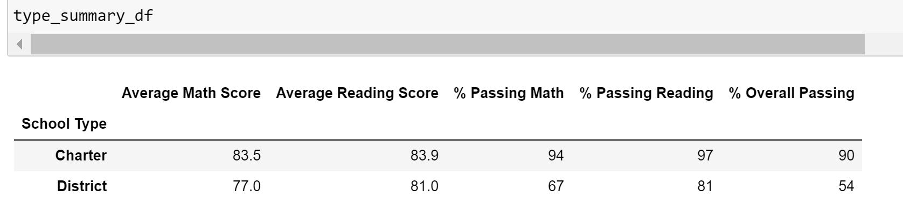
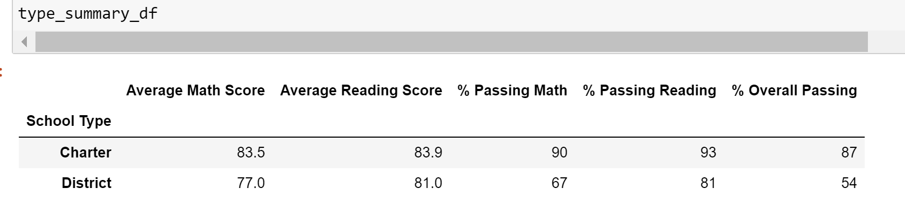

# School_District_Analysis
Week 4, Anaconda, Jupiter Notebook, Python

---

## Overview of the School District Analysis: 
In the initial part of the analysis, the purpose was to provide insights about schools performance, trends and patterns based on data about funding and standardized test scores. The information was given as per student scores, and in the analysis it was aggregated in various ways to provide insights. The funding data was also analyzed in various ways to better understand if and how funding impacts school performance. The analysis is intended to inform discussions at the district and school level regarding budget and priorities. 

In the second part (the challenge) the original analysis was modified after discovering that a subset of the students grades have been altered. Specifically the math and reading grades for Thomas High School 9th graders. In the new analysis, these grades were eliminated while the rest of the data remained intact. This report describes how eliminating these grades impacts the overall analysis. 

---

## Link to Complete Code


---

## Results: 

The following are the changes that occured after removing the grades for the 9th graders at Thomas High School. 


### The Effect on the District Summary:

At the district level, taking out the math and reading grades from Thomas High School 9th grade caused a small reduction in the % of students that passed standardized math and reading tests and a small reduction from 65 to 64.9 in overall passing percentage.The district summary before and after the changes are presented below. 

#### Image of School District Analysis


#### Image of School District Analysis Refactored


### The Effect on the School Summary:

At the school level, obviously, the only school impacted by these changes is Thomas High School. Prior to the changes, the results for Thomas High School Were:

#### Image of Thomas High School Summary


#### Image of Thomas High School Summary Refactored


After all the grades for 9th grade were replaced by Nan, there was a significant drop in the percentage of students in the school that passed the standardized tests. Both math and reading. When calculating the percentages of students that passed the tests, the student name column was used to count the students. This included all the students in the school including the 9th graders. With their grades being switched to "nothing" the percentage of students that passed changed significantly. 
```
# Calculate the number of students passing math and passing reading by school.
per_school_passing_math = per_school_passing_math.groupby(["school_name"]).count()["student_name"]
per_school_passing_reading = per_school_passing_reading.groupby(["school_name"]).count()["student_name"]

# Calculate the percentage of passing math and reading scores per school.
per_school_passing_math = per_school_passing_math / per_school_counts * 100
per_school_passing_reading = per_school_passing_reading / per_school_counts * 100

```

### The Change in Thomas High School’s Performance Relative to the Other Schools:

Before replacing the grades, Thomas High School was ranked number 2 after Cabrera High School. After the change, Thomas High School dropped to number 8 with much lower overall passing percentages. 

```
# Sort and show top five schools.
top_schools = per_school_summary_df.sort_values(["% Overall Passing"], ascending=False)

top_schools.head()
```

### Effect on Math and Reading Scores by Grade:

Math and reading score by grade all grades would remain the same, except that in the 9th grade scores for Thomas High School there are no grades. It is Nan (=not a number) where originally it was 83.6.


#### Image of Scores by Grade Refactored



### Effect on Scores by School Spending

Scores by school spending, there was no change in the top and lowest bracket of school spending. In the two brackets in the middle there was some change as seen below. The first dataframe is showing the data prior to the change. the second dataframe is showing the numbers after the changes. Thomas High school was in the third bracket with $638 spending per student. Reducing the passing percentages for Thomas High School reduced the passing percentages for that third bracket. 

#### Image of Scores by School Spending



#### Image of Scores by School Spending Refactored



### Effect on Scores by School Size
Thomas High School has 1635 students. As such it belongs to the medium school size bracket. The passing percentages for the medium school size went down after the change. The first dataframe below is before the change and the second one is after the change. 

#### Image of Scores by School Size


#### Image of Scores by School Size Refactored



### Effect on Scores by School Type

Thomas High School is a charter school. You can see that the passing percentages went down after the change for the charter schools. District school numbers remained the same. 

#### Image of Scores by School Type



#### Image of Scores by School Type Refactored



---

## Summary: 
The major changes that occured after replacing the 9th grade math and reading scores at Thomas High School with Nan's were:
1. Thomas High School percentages went down very signifficantly. The school summary which includes % Passing Math, % Passing Reading, % Overall Passing showed a significant drop in passing percentages. 
2. Thomas High School performance relative to other schools went from being second to being number 8. It went down very significantly. 
3. Scores by grade, 9th grade math and reading scores for Thomas High school were Nan's or in other words not a number. 
4. Thomas High School is a medium size charter school. When looking at the schools by school type and size these brackets where Thomas High school was located were affected negatively. Their passing percentages went down. 


