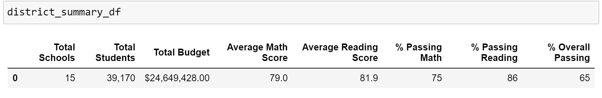

# School_District_Analysis
Week 4, Anaconda, Jupiter Notebook, Python

## Overview of the school district analysis: 
In the initial part of the analysis, the purpose was to provide insights about schools performance, trends and patterns based on data about funding and standardized test scores. The information was given as per student scores, and in the analysis it was aggregated in various ways to provide insights. The funding data was also analyzed in various ways to better understand if and how funding impacts school performance. The analysis is intended to inform discussions at the district and school level regarding budget and priorities. 

In the second part (the challenge) the original analysis was modified after discovering that a subset of the students grades have been altered. Specifically the math and reading grades for Thomas High School 9th graders. In the new analysis, these grades were eliminated while the rest of the data remained intact. This report describes how eliminating these grades impacts the overall analysis. 

## Link to Complete Code


## Results: 
Using bulleted lists and images of DataFrames as support, address the following questions.

- How is the district summary affected?

  The district summary prior to the change had the following results:

### Image of School District Analysis


### Image of School District Analysis Refactored


	    

Following the change, the results were:

Total Schools	Total Students	Total Budget	Average Math Score	Average Reading Score	% Passing Math	% Passing Reading	% Overall Passing
15	            39,170	        $24,649,428.00	78.9	            81.9	                74.8	        85.7	            64.9

At the district level, taking out the math and reading grades from Thomas High School 9th grade caused a small reduction in the % of students that passed standardized math and reading tests and a small reduction from 65 to 64.9 in overall passing percentage.

- How is the school summary affected?

At the school level, obviously, the only school impacted by these changes is Thomas High School. Prior to the changes, the results for Thomas High School Were:

School Type	Total Students	Total School Budget	Per Student Budget	Average Math Score	Average Reading Score	% Passing Math	% Passing Reading	% Overall Passing
Charter	    1635	        $1,043,130.00	    $638.00	            83.418349	        83.848930	            93.272171	    97.308869	        90.948012

After taking out the grades the results were:
School Type	Total Students	Total School Budget	Per Student Budget	Average Math Score	Average Reading Score	% Passing Math	% Passing Reading	% Overall Passing
Charter	    1635	        $1,043,130.00	    $638.00	            83.350937	        83.896082	            66.911315	    69.663609	        65.076453

After all the grades for 9th grade were taken out, there was a significant drop in the percentage of students in the school that passed the standardized tests. Both math and reading. When calculating the percentages of students that passed the tests, the student name column was used to count the students. This included all the students in the school including the 9th graders. With their grades being switched to "nothing" the percentage of students that passed changed significantly. 
```
# Calculate the number of students passing math and passing reading by school.
per_school_passing_math = per_school_passing_math.groupby(["school_name"]).count()["student_name"]
per_school_passing_reading = per_school_passing_reading.groupby(["school_name"]).count()["student_name"]

# Calculate the percentage of passing math and reading scores per school.
per_school_passing_math = per_school_passing_math / per_school_counts * 100
per_school_passing_reading = per_school_passing_reading / per_school_counts * 100

```

- How does replacing the ninth graders’ math and reading scores affect Thomas High School’s performance relative to the other schools?

Before the change, Thomas High School was ranked number 2 after Cabrera High School. After the change, Thomas High School dropped to number 8 with much lower overall passing percentages. 

```
# Sort and show top five schools.
top_schools = per_school_summary_df.sort_values(["% Overall Passing"], ascending=False)

top_schools.head()
```

- How does replacing the ninth-grade scores affect the following:
- Math and reading scores by grade
Math and reading score by grade all grades would remain the same, except that in the 9th grade scores for Thomas High School there are no grades. It is Nan (=not a number) where originally it was 83.6.

- Scores by school spending

Scores by school spending, there was no change in the top and lowest bracket of school spending. In the two brackets in the middle there was some change as seen below. The first dataframe is showing the data prior to the change. the second dataframe is showing the numbers after the changes. Thomas High school was in the third bracket with $638 spending per student. Reducing the passing percentages for Thomas High School reduced the passing percentages for that third bracket. 

Spending Ranges (Per Student)	Average Math Score	Average Reading Score	% Passing Math	% Passing Reading	% Overall Passing				
<$584	                        83.5	            83.9	                93	            97	                90
$585-629	                    81.9	            83.2	                87	            93	                81
$630-644	                    78.5	            81.6	                73	            84	                63
$645-675	                    77.0	            81.0	                66	            81	                54


Spending Ranges (Per Student)	Average Math Score	Average Reading Score	% Passing Math	% Passing Reading	% Overall Passing				
<$584	                        83.5	            83.9	                93	            97	                90
$585-629	                    83.6	            83.9	                94	            96	                90
$630-644	                    79.1	            81.9	                71	            81	                62
$645-675	                    77.0	            81.0	                66	            81	                54


- Scores by school size
Thomas High School has 1635 students. As such it belongs to the medium school size bracket. The passing percentages for the medium school size went down after the change. The first dataframe below is before the change and the second one is after the change. 


School Size		        	Average Math Score	Average Reading Score	% Passing Math	% Passing Reading	% Overall Passing			
Small (<1000)	            83.8	            83.9	                94	            96	                90
Medium (1000-2000)	        83.4	            83.9	                94	            97	                91
Large (2000-5000)	        77.7	            81.3	                70	            83	                58


School Size		            Average Math Score	Average Reading Score	% Passing Math	% Passing Reading	% Overall Passing			
Small (<1000)	            83.8	            83.9	                94	            96	                90
Medium (1000-2000)	        83.4	            83.9	                88	            91	                85
Large (2000-5000)	        77.7	            81.3	                70	            83	                58


- Scores by school type
Thomas High School is a charter school. You can see that the passing percentages went down after the change for the charter schools. District school numbers remained the same. 

School Type		Average Math Score	Average Reading Score	% Passing Math	% Passing Reading	% Overall Passing			
Charter	        83.5	            83.9	                94	            97	                90
District	    77.0	            81.0	                67	            81	                54


School Type	    Average Math Score	Average Reading Score	% Passing Math	% Passing Reading	% Overall Passing				
Charter	        83.5	            83.9	                90	            93	                87
District	    77.0	            81.0	                67	            81	                54

## Summary: 
The major changes that occured after replacing the 9th grade math and reading scores at Thomas High School with Nan's were:
1. Thomas High School percentages went down very signifficantly. The school summary which includes % Passing Math, % Passing Reading, % Overall Passing showed a significant drop in passing percentages. 
2. Thomas High School performance relative to other schools went from being second to being number 8. It went down very significantly. 
3. Scores by grade, 9th grade math and reading scores for Thomas High school were Nan's or in other words not a number. 
4. Thomas High School is a medium size charter school. When looking at the schools by school type and size these brackets where Thomas High school was located were affected negatively. Their passing percentages went down. 


